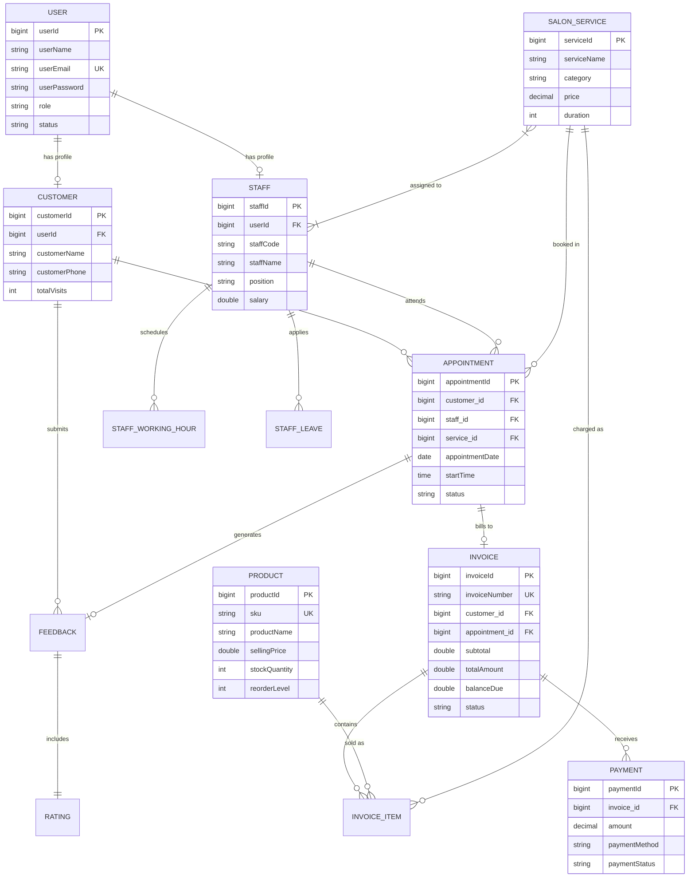

# 🌸 Pink Beauty Salon — Management System

A comprehensive, full-stack enterprise **Salon Management System** designed for modern luxury salons and beauty clinics. Built with **Spring Boot**, **Spring Security (JWT)**, **Spring Data JPA**, **MySQL**, and a responsive luxury-themed frontend interface.

---

## 📌 Table of Contents
1. [Overview](#-overview)
2. [Key Features & Modules](#-key-features--modules)
3. [System Architecture](#-system-architecture)
4. [Technology Stack](#-technology-stack)
5. [Database Architecture & ER Diagram](#-database-architecture--er-diagram)
6. [REST API Documentation](#-rest-api-documentation)
7. [User Roles & Permissions](#-user-roles--permissions)
8. [Frontend Pages & UI Components](#-frontend-pages--ui-components)
9. [Prerequisites & System Requirements](#-prerequisites--system-requirements)
10. [Installation & Setup Guide](#-installation--setup-guide)
11. [Configuration (`application.properties`)](#-configuration-applicationproperties)
12. [Testing & Verification](#-testing--verification)
13. [Future Enhancements Roadmap](#-future-enhancements-roadmap)

---

## 🌟 Overview

The **Pink Beauty Salon Management System** provides an end-to-end digital operational platform for salon owners, receptionists, stylists, and clients. It handles everything from customer appointment booking, stylist roster scheduling, inventory and retail product tracking, to invoicing, payment processing, customer reviews, and high-level analytical business dashboards.

### Core Highlights:
- **Luxury Aesthetic UI**: Custom glassmorphism, responsive cards, and curated Rose Gold (`#B76E79`) and Champagne (`#E8C07D`) palette.
- **Secure JWT Authentication**: Role-based access control with stateless JSON Web Tokens.
- **Dynamic Business Dashboard**: Real-time KPI metrics, revenue charts, and operational summaries powered by Chart.js.
- **Automated Calculations**: Invoicing with tax rates, percentage-based discounts, outstanding balances, and inventory re-order alerts.

---

## 🚀 Key Features & Modules

### 1. 🔐 Authentication & User Management
- Secure user registration and login with encrypted passwords (`BCrypt` strength 12).
- Stateless JWT issuance upon login with 24-hour expiration.
- Password change and administrator temporary password reset capabilities.
- Role management: `OWNER`, `RECEPTIONIST`, `STAFF`, and `CUSTOMER`.

### 2. 👥 Customer Management
- Complete customer profiles (name, email, phone, DOB, gender, address, personal beauty notes).
- Visit history tracking (`totalVisits`, `lastVisitDate`).
- Quick search by name/phone/email and status filters (`Active` / `Inactive`).
- Direct export of customer data.

### 3. 💇‍♀️ Staff & Stylist Management
- Detailed stylist records (staff code, position, hiring date, base salary, status).
- Flexible working hours scheduling per staff member (`dayOfWeek`, `startTime`, `endTime`, `isWorkingDay`).
- Staff leave management (Annual, Sick, Casual, Maternity, Unpaid) with Approval/Rejection workflow.
- Availability status toggling (`AVAILABLE`, `ON_LEAVE`, `BUSY`).

### 4. ✂️ Service Catalog Management
- Comprehensive salon services catalog categorized by Hair, Skin, Nails, Massage, Bridal, etc.
- Service duration (in minutes) and pricing (`BigDecimal` precision).
- Many-to-many relationship between services and qualified staff members.
- Dynamic status toggling (`Active` / `Inactive`).

### 5. 📅 Appointment Scheduling
- Real-time appointment booking linking Customer, Service, and Staff.
- Appointment lifecycle tracking: `SCHEDULED` ➔ `CONFIRMED` ➔ `COMPLETED` / `CANCELLED` / `NO_SHOW`.
- Date-based query filters and customer/staff specific appointment schedules.
- Direct association with invoices and post-service customer feedback.

### 6. 🧾 Invoicing & Billing
- Automated unique invoice generation (`INV-YYYYMMDD-XXXX`).
- Multiple itemized charges supporting both Salon Services and Retail Products.
- Calculation of subtotal, configurable discount percentage, tax rate, and net total.
- Tracking of `amountPaid` and `balanceDue` with automatic status updates (`DRAFT`, `ISSUED`, `PAID`, `PARTIALLY_PAID`, `CANCELLED`).

### 7. 💳 Payment Processing
- Multi-channel payment recording: `CASH`, `CARD`, `ONLINE_TRANSFER`, `CHEQUE`, `GIFT_CARD`.
- Payment status flow: `PENDING`, `COMPLETED`, `FAILED`, `REFUNDED`.
- Transaction reference tracking and partial/full refund capabilities.
- Payment history aggregation by date range, invoice ID, and payment method.

### 8. 📦 Product & Inventory Management
- Retail product tracking with SKU, category, brand, cost price, and selling price.
- Real-time stock levels with automatic low-stock alerts when quantity hits `reorderLevel`.
- Out-of-stock indicators and total inventory valuation metrics.
- Stock adjustment logs (Restock, Damage, Return, Correction).

### 9. ⭐ Customer Feedback & Ratings
- Post-service star ratings (1 to 5 stars) and client reviews.
- Feedback status moderation: `PENDING`, `REVIEWED`, `REJECTED`.
- Statistical aggregation: Average rating score, rating distribution histogram, and per-service performance ratings.

### 10. 📊 Analytics & Reporting Engine
- **Overall Business Analytics**: Total revenue, appointments count, customer acquisition rate.
- **Revenue Analytics**: Daily, weekly, and monthly revenue breakdown.
- **Staff Performance**: Completed appointments and revenue generated per staff member.
- **Service Performance**: Top-booked services and revenue contribution.
- Date-range filtered custom reporting exports.

### 11. ⚙️ System Settings & Configuration
- Salon profile management (Name, Tagline, Contact Phone, Email, Address).
- Operational business hours (Opening Time, Closing Time).
- Default appointment slot duration and cancellation policy text.
- Currency selection (Default: `LKR`) and automated Notification toggles (Email & SMS).

---

## 🏗 System Architecture

The project follows the standard **Enterprise 3-Tier Layered Architecture**:

```
                               ┌─────────────────────────────────────────┐
                               │       Client / Browser UI Tier          │
                               │  HTML5 / CSS3 / Vanilla JS / Chart.js   │
                               └────────────────────┬────────────────────┘
                                                    │ HTTP / JSON (REST APIs)
                                                    ▼
┌────────────────────────────────────────────────────────────────────────┐
│                        Spring Boot Backend Tier                        │
│                                                                        │
│  ┌──────────────────────────────────────────────────────────────────┐  │
│  │ Security Filter Chain: JwtAuthenticationFilter + DaoAuth Provider │  │
│  └──────────────────────────────────┬───────────────────────────────┘  │
│                                     ▼                                  │
│  ┌──────────────────────────────────────────────────────────────────┐  │
│  │ Controllers (@RestController): Expose REST endpoints with DTOs   │  │
│  └──────────────────────────────────┬───────────────────────────────┘  │
│                                     ▼                                  │
│  ┌──────────────────────────────────────────────────────────────────┐  │
│  │ Service Layer (@Service): Business logic, calculations, rules   │  │
│  └──────────────────────────────────┬───────────────────────────────┘  │
│                                     ▼                                  │
│  ┌──────────────────────────────────────────────────────────────────┐  │
│  │ Repositories (Spring Data JPA): Query methods & pagination       │  │
│  └──────────────────────────────────┬───────────────────────────────┘  │
└─────────────────────────────────────┼──────────────────────────────────┘
                                      │ JDBC / Hibernate ORM
                                      ▼
                               ┌──────────────┐
                               │ MySQL 8.x DB │
                               └──────────────┘
```

---

## 💻 Technology Stack

| Component | Technology | Version / Details |
|---|---|---|
| **Backend Framework** | Java Spring Boot | 4.x / Java 21 |
| **Security & Auth** | Spring Security + JJWT | JJWT `0.12.6`, BCrypt Password Hashing |
| **ORM & Persistence** | Spring Data JPA / Hibernate | Object-Relational Mapping with MySQL |
| **Database** | MySQL | 8.0+ |
| **Build & Dependency Tool** | Apache Maven | Maven Wrapper (`mvnw`) included |
| **Boilerplate Reduction** | Project Lombok | `@Data`, `@RequiredArgsConstructor`, etc. |
| **Frontend Technologies** | HTML5, CSS3, JavaScript | Modern CSS Variables, Flexbox/Grid |
| **Icons & Fonts** | Font Awesome 6 & Google Fonts | Inter, Playfair Display, Cormorant Garamond |
| **Data Visualizations** | Chart.js | Version 4.4.2 |

---

## 🗄 Database Architecture & ER Diagram



---

## 🌐 REST API Documentation

All API responses follow a uniform wrapper format:
```json
{
  "code": 0,
  "data": { ... },
  "message": "Operation successful message"
}
```

### 1. Authentication & Users (`/api/v1/user`, `/api/v1/admin-users`)
| Method | Endpoint | Description | Auth Required |
|---|---|---|---|
| `POST` | `/api/v1/user/save` | Register new user account | No |
| `POST` | `/api/v1/user/login` | Login with email & password, returns JWT token | No |
| `PUT` | `/api/v1/user/change-password` | Update current user's password | Yes (Bearer JWT) |
| `GET` | `/api/v1/admin-users/all` | Get all system users | No / Admin |
| `POST` | `/api/v1/admin-users/save` | Create administrative user | No / Admin |
| `PUT` | `/api/v1/admin-users/update/{id}` | Update administrative user | No / Admin |
| `DELETE` | `/api/v1/admin-users/delete/{id}` | Delete system user | No / Admin |
| `POST` | `/api/v1/admin-users/{id}/reset-password`| Reset user password to temporary password | No / Admin |

### 2. Customers (`/api/v1/customers`)
| Method | Endpoint | Description |
|---|---|---|
| `POST` | `/api/v1/customers/save` | Register/create a new customer profile |
| `GET` | `/api/v1/customers/all` | Retrieve all registered customers |
| `PUT` | `/api/v1/customers/update` | Update existing customer details |
| `DELETE` | `/api/v1/customers/delete/{id}` | Remove customer record |
| `GET` | `/api/v1/customers/search?name={query}` | Search customers by name |

### 3. Staff (`/api/v1/staff`)
| Method | Endpoint | Description |
|---|---|---|
| `POST` | `/api/v1/staff/save` | Create a new staff profile |
| `GET` | `/api/v1/staff/all` | List all salon staff |
| `GET` | `/api/v1/staff/{id}` | Get detailed staff record |
| `PUT` | `/api/v1/staff/update/{id}` | Update staff details |
| `DELETE` | `/api/v1/staff/delete/{id}` | Remove staff member |
| `PATCH` | `/api/v1/staff/status/{id}` | Toggle staff active/inactive status |
| `GET` | `/api/v1/staff/{id}/working-hours` | Get staff weekly working hours |
| `PUT` | `/api/v1/staff/{id}/working-hours` | Update staff working schedule |
| `POST` | `/api/v1/staff/{id}/leave` | Submit leave request for staff |
| `GET` | `/api/v1/staff/{id}/leave` | View staff leave history |
| `PATCH` | `/api/v1/staff/leave/{leaveId}/status` | Approve or reject leave request |

### 4. Salon Services (`/api/v1/services`)
| Method | Endpoint | Description |
|---|---|---|
| `POST` | `/api/v1/services/save` | Add new salon service |
| `GET` | `/api/v1/services/all` | List all salon services |
| `GET` | `/api/v1/services/{id}` | Get service by ID |
| `PUT` | `/api/v1/services/update` | Update service pricing/duration |
| `DELETE` | `/api/v1/services/delete/{id}` | Delete service |
| `PATCH` | `/api/v1/services/status/{id}` | Toggle service active status |
| `PUT` | `/api/v1/services/assign-staff/{id}` | Assign staff members to service |

### 5. Appointments (`/api/v1/appointment`)
| Method | Endpoint | Description |
|---|---|---|
| `POST` | `/api/v1/appointment/save` | Book a new appointment |
| `GET` | `/api/v1/appointment/all` | Get all appointments |
| `GET` | `/api/v1/appointment/{id}` | Get appointment details |
| `PUT` | `/api/v1/appointment/update/{id}` | Update appointment schedule or status |
| `DELETE` | `/api/v1/appointment/delete/{id}` | Cancel/Delete appointment |
| `GET` | `/api/v1/appointment/customer/{customerId}` | List appointments for specific customer |
| `GET` | `/api/v1/appointment/staff/{staffId}` | List appointments for specific staff |
| `GET` | `/api/v1/appointment/date/{date}` | Get appointments scheduled on a given date |

### 6. Invoices & Billing (`/api/v1/invoices`)
| Method | Endpoint | Description |
|---|---|---|
| `POST` | `/api/v1/invoices/save` | Generate new customer invoice |
| `GET` | `/api/v1/invoices/all` | Retrieve all invoices |
| `GET` | `/api/v1/invoices/{id}` | Get invoice with line items |
| `PUT` | `/api/v1/invoices/update/{id}` | Modify invoice |
| `DELETE` | `/api/v1/invoices/delete/{id}` | Void / Delete invoice |
| `GET` | `/api/v1/invoices/status?status={status}`| Filter invoices by status |
| `GET` | `/api/v1/invoices/stats` | Invoicing statistics & totals |

### 7. Payments (`/api/v1/payments`)
| Method | Endpoint | Description |
|---|---|---|
| `POST` | `/api/v1/payments/save` | Record payment against invoice |
| `GET` | `/api/v1/payments/all` | List all payment transactions |
| `GET` | `/api/v1/payments/{id}` | Get payment by transaction ID |
| `PATCH` | `/api/v1/payments/refund/{id}` | Issue refund for payment |
| `GET` | `/api/v1/payments/date-range?from=..&to=..` | Payments between date ranges |
| `GET` | `/api/v1/payments/invoice/{invoiceId}` | All payments under specific invoice |

### 8. Products & Inventory (`/api/v1/product`)
| Method | Endpoint | Description |
|---|---|---|
| `POST` | `/api/v1/product/save` | Create new product |
| `GET` | `/api/v1/product/all` | List all retail products |
| `GET` | `/api/v1/product/{productId}` | Retrieve product details |
| `PUT` | `/api/v1/product/update/{productId}` | Update product information |
| `DELETE` | `/api/v1/product/delete/{productId}` | Delete product |
| `PATCH` | `/api/v1/product/{productId}/stock` | Adjust stock count |
| `GET` | `/api/v1/product/stats` | Total products, inventory value, low stock count |
| `GET` | `/api/v1/product/low-stock` | Get products below reorder threshold |
| `GET` | `/api/v1/product/out-of-stock` | Get products with 0 stock |

### 9. Feedback & Ratings (`/api/v1/feedback`)
| Method | Endpoint | Description |
|---|---|---|
| `POST` | `/api/v1/feedback` | Submit rating & review for appointment |
| `GET` | `/api/v1/feedback` | List all customer feedback |
| `GET` | `/api/v1/feedback/statistics` | Average rating score & total count |
| `GET` | `/api/v1/feedback/rating-distribution`| Star ratings distribution (1 to 5 stars) |
| `GET` | `/api/v1/feedback/service-performance`| Ratings grouped by salon service |
| `PATCH` | `/api/v1/feedback/{id}/reviewed` | Mark feedback as reviewed |

### 10. Dashboard & Analytics (`/api/v1/dashboard`, `/api/v1/reports`)
| Method | Endpoint | Description |
|---|---|---|
| `GET` | `/api/v1/dashboard` | Main dashboard summary & KPI metrics |
| `GET` | `/api/v1/dashboard/date-range` | Filter dashboard metrics by date range |
| `GET` | `/api/v1/reports/analytics/overall` | Overall business report analytics |
| `GET` | `/api/v1/reports/analytics/revenue` | Revenue breakdown across date range |
| `GET` | `/api/v1/reports/analytics/appointments` | Appointment completion metrics |
| `GET` | `/api/v1/reports/analytics/staff` | Individual staff performance report |
| `GET` | `/api/v1/reports/analytics/services` | Service popularity and revenue report |

### 11. Settings (`/api/v1/settings`)
| Method | Endpoint | Description |
|---|---|---|
| `POST` | `/api/v1/settings/save` | Initialize salon business settings |
| `GET` | `/api/v1/settings` | Get current salon settings |
| `PUT` | `/api/v1/settings/update` | Update salon settings (hours, currency, policies) |

---

## 👥 User Roles & Permissions

| Feature / Module | OWNER | RECEPTIONIST | STAFF | CUSTOMER |
|---|:---:|:---:|:---:|:---:|
| **View Dashboard & KPI Analytics** | ✅ Full | ✅ Limited | ❌ | ❌ |
| **Manage Users & Role Assignments** | ✅ | ❌ | ❌ | ❌ |
| **Manage Salon Settings & Policies** | ✅ | ❌ | ❌ | ❌ |
| **Manage Customer Profiles** | ✅ | ✅ | 👁️ View Only | 👤 Self Only |
| **Book & Manage Appointments** | ✅ | ✅ | 👁️ Own Only | 👤 Self Book |
| **Manage Services & Pricing** | ✅ | 👁️ View Only | 👁️ View Only | 👁️ View Only |
| **Manage Staff & Leave Approvals** | ✅ | ❌ | ❌ | ❌ |
| **Create & Process Invoices/Payments**| ✅ | ✅ | ❌ | 👁️ Own Bills |
| **Adjust Product Inventory** | ✅ | ✅ | ❌ | ❌ |
| **Submit Ratings & Reviews** | ❌ | ❌ | ❌ | ✅ |
| **View Reports & Export Financials** | ✅ | ❌ | ❌ | ❌ |

---

## 🖥 Frontend Pages & UI Components

The frontend is served directly through Spring Boot's static resources (`src/main/resources/static/`):

1. **`index.html`**: Luxury public landing page with service showcase, about section, stylists, testimonials, and online appointment request modal.
2. **`login.html`**: Sleek login screen saving JWT, user role, and user details into `localStorage`.
3. **`registion.html`**: User registration portal.
4. **`change-password.html`**: Password reset and update interface.
5. **`dashboard.html`**: Central command dashboard featuring real-time revenue cards, appointment status widgets, staff availability, and revenue charts.
6. **`userMangemnt.html`**: User accounts table, status switcher (`Active`/`Inactive`), role manager, and admin password reset dialog.
7. **`customerManagement.html`**: Customer directory, search filters, visit history, and add/edit modal.
8. **`staffManagement.html`**: Stylists directory, working hours scheduler, and leave approval interface.
9. **`serviceManagement.html`**: Service cards and pricing list, duration settings, and staff assignment.
10. **`appointmentManagement.html`**: Interactive calendar, appointment slot booking, status updates, and customer reminders.
11. **`productManagement.html`**: Product inventory catalog with SKU, brand, pricing, and category filters.
12. **`inventoryMangement.html`**: Dedicated warehouse & stock monitoring with low-stock warnings and restock adjustments.
13. **`paymentMangement.html`**: Invoicing module, line-item builder, tax/discount calculation, and receipt generation.
14. **`feedback.html`**: Customer reviews management, star ratings analytics, and sentiment overview.
15. **`report.html`**: Custom date-range financial and operational reports with export tools.
16. **`settings.html`**: System configuration for salon operational hours, contact details, currency, and notification toggles.

---

## ⚙️ Prerequisites & System Requirements

Before running the application, ensure the following software is installed on your machine:
- **Java Development Kit (JDK)**: Version 21 or higher (LTS recommended)
- **Apache Maven**: Version 3.8+ (or use the included `./mvnw` wrapper)
- **MySQL Database Server**: Version 8.0 or higher
- **Web Browser**: Google Chrome, Mozilla Firefox, Microsoft Edge, or Safari (modern version with ES6 support)

---

## 🚀 Installation & Setup Guide

### Step 1: Clone or Open the Repository
Open your terminal or IDE in the project directory:
```bash
cd "Salon-Management-System"
```

### Step 2: Database Setup
1. Start your MySQL database service.
2. Open MySQL Command Line or MySQL Workbench:
```sql
CREATE DATABASE salon_management;
```
*(Note: Spring Boot is configured with `createDatabaseIfNotExist=true`, but creating it explicitly ensures appropriate permissions).*

### Step 3: Configure Database Credentials
Open `src/main/resources/application.properties` and verify your MySQL username and password:
```properties
spring.datasource.url=jdbc:mysql://localhost:3306/salon_management?createDatabaseIfNotExist=true
spring.datasource.username=root
spring.datasource.password=YOUR_MYSQL_PASSWORD
```

### Step 4: Build the Project
Using the Maven wrapper:
- **Windows (PowerShell / Command Prompt)**:
  ```powershell
  .\mvnw.cmd clean package -DskipTests
  ```
- **Linux / macOS**:
  ```bash
  ./mvnw clean package -DskipTests
  ```

### Step 5: Run the Application
Run the Spring Boot application using Maven:
- **Windows**:
  ```powershell
  .\mvnw.cmd spring-boot:run
  ```
- **Linux / macOS**:
  ```bash
  ./mvnw spring-boot:run
  ```

Or run the generated JAR file:
```bash
java -jar target/Salon-Management-System-0.0.1-SNAPSHOT.jar
```

### Step 6: Access the Application
Once the server starts successfully on port `8080`:
- **Landing Page**: [http://localhost:8080/](http://localhost:8080/) or [http://localhost:8080/index.html](http://localhost:8080/index.html)
- **Login Portal**: [http://localhost:8080/login.html](http://localhost:8080/login.html)
- **Dashboard**: [http://localhost:8080/dashboard.html](http://localhost:8080/dashboard.html)

---

## ⚙️ Configuration (`application.properties`)

```properties
spring.application.name=Salon-Management-System

# Database Configuration
spring.datasource.url=jdbc:mysql://localhost:3306/salon_management?createDatabaseIfNotExist=true
spring.datasource.username=root
spring.datasource.password=mysql

# Hibernate & JPA
spring.jpa.hibernate.ddl-auto=update
spring.jpa.show-sql=true

# JWT Configuration
jwt.secret=salonManagementSystemSecretKeyForJWTAuthentication2026
jwt.expiration=86400000
```

---

## 🧪 Testing & Verification

Execute automated unit and integration tests:
```powershell
.\mvnw.cmd test
```

### Manual Verification Checklist:
- [x] Register user via `/api/v1/user/save` or `registion.html`.
- [x] Login via `/api/v1/user/login` or `login.html` and verify JWT token storage in `localStorage`.
- [x] Add Salon Services and assign Stylists.
- [x] Schedule an appointment and verify conflicting time slots.
- [x] Generate Invoice with line items and record full/partial payment.
- [x] Check Inventory stock decrement and low-stock indicators.
- [x] Review KPI metrics on the Dashboard.

---

## 🔮 Future Enhancements Roadmap

- [ ] **Automated SMS & WhatsApp Reminders**: Integrate Twilio / WhatsApp Business API for appointment reminders.
- [ ] **Online Payment Gateway**: Integration with Stripe, PayPal, or PayHere for online deposits.
- [ ] **Client Mobile App**: Dedicated mobile application for self-service booking.
- [ ] **Staff Commission Calculator**: Automatic stylist commission calculation based on performed services.
- [ ] **Multi-Branch Support**: Scalability to manage multiple salon branches under one owner account.

---

**Developed for Pink Beauty Salon** • *Luxury Beauty Meets Smart Technology* 💅✨
